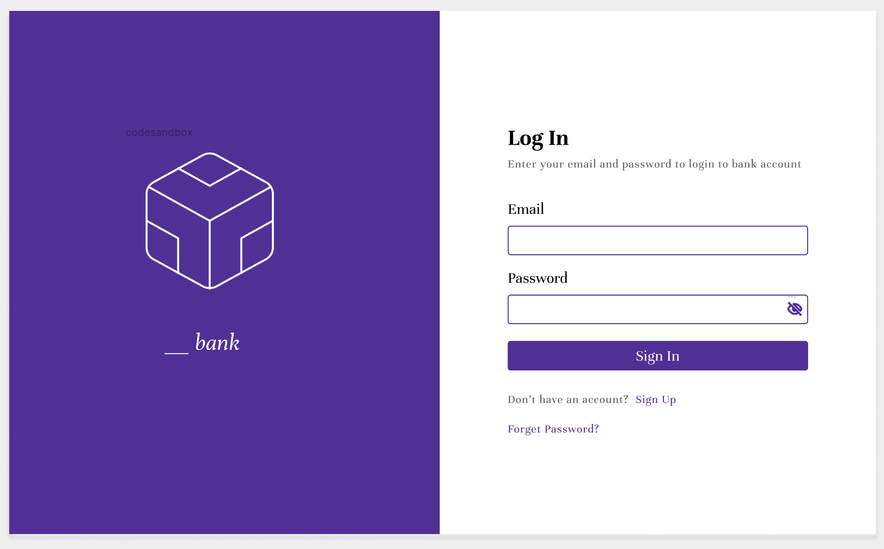
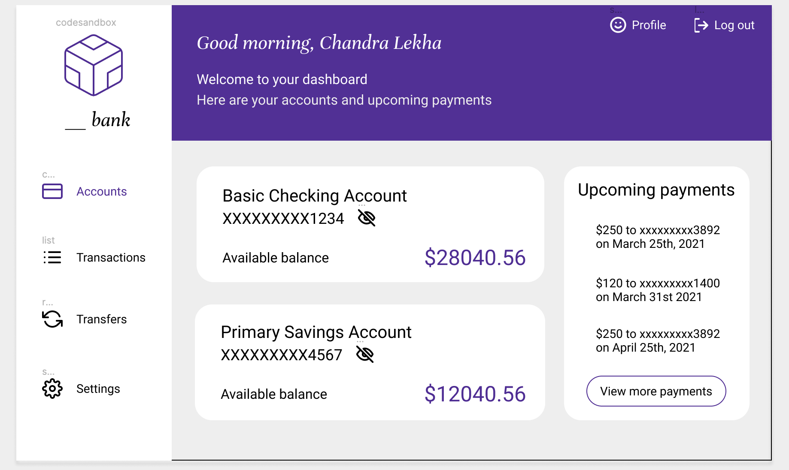
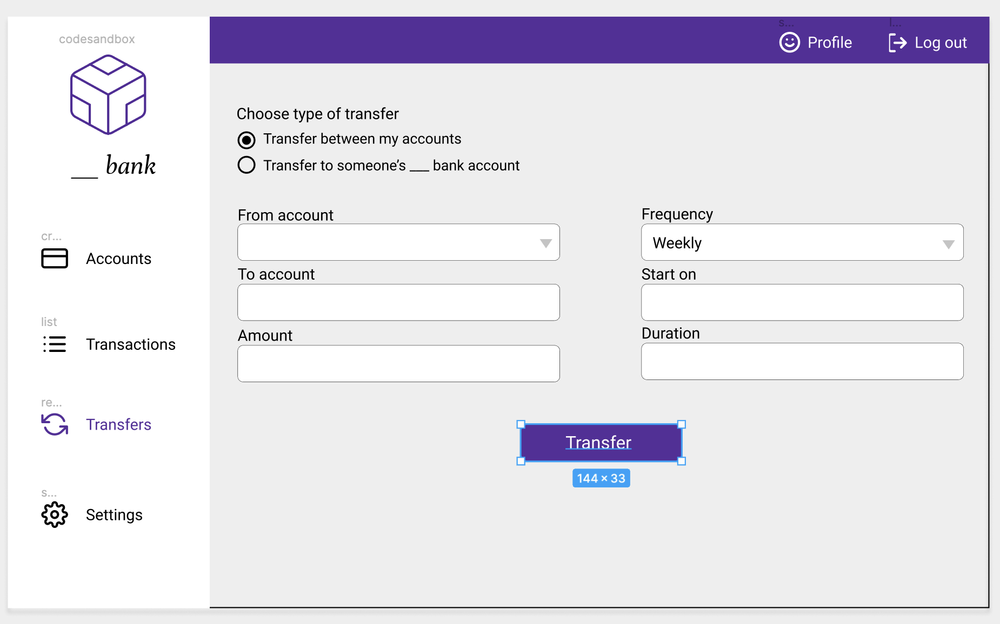
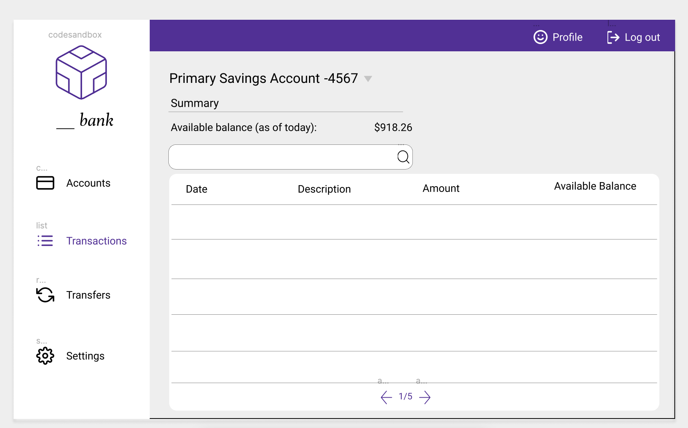
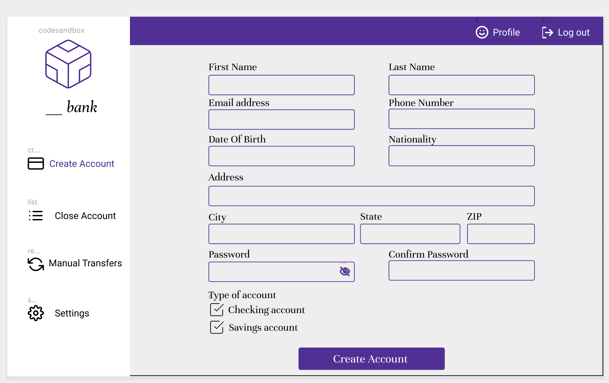

# Team6Bank

## Team Members

- Himaja Chandaluri
- Sravya Ratna Chandra Lekha Mamidi
- Sagnik Chowdhury
- Anjali Poddar

## Tech Stack

> MERN Stack
- **Frontend** : React
- **Backend** : Node.js
- **API Management** : Express
- **Database** : MongoDB

## Banking System features

> Two roles **ADMIN** and **USER**

### User

- Can login, but not register
- View a summary of linked accounts
- View and search past 18 month transactions and future transaction
- Can transfer between his/her accounts
- Can transfer to other accounts within the bank
- Can transfer to accounts in other banks 

### Admin

- Create account for users with corresponding Saving and/or Checking accounts
- Delete a users Saving or Checking or whole Account based on user's request
- Can deposit money into customers account, on their behalf
- Can transfer betwwen accounts in the bank, based on user request
- Can transfer money to accounts in anoter bank based on user request

## Architecture Diagram

## Deployment Diagram


## UI Mocks Vs. Final design 

**Mocks**            |  **Final**
:-------------------------:|:-------------------------:
 | 
 | 
  |  
 | 
 | 

## XP Value

### **Respect**

Throughout the project all the teammates respected others opinions, suggestions, their availability, and timelines.

## Sprints

> Detailed Sprint task distribution in ```DeliverableDocuments/SprintCharts.xlsx```

### Sprint 1 (**March 28** to **April 10**)


### Sprint 2 (**April 11** to **April 24**)


### Sprint 3 (**April 25** to **May 8**)


### Sprint 4 (**May 9** to **May 14**)


